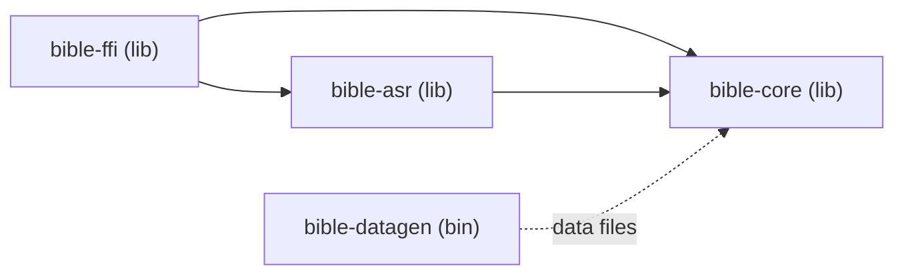

# Architecture — SERMON (HV-Bible)

## Overview

SERMON is a deterministic, offline-first Bible navigation engine built in Rust, targeting iOS and Android via UniFFI-generated bindings. The system resolves a pastor's spoken verse reference to on-screen text in under 200ms.

## Crate Dependency Graph



**Enforced rules:**
- `bible-core` depends on nothing else in the workspace
- `bible-asr` depends only on `bible-core`
- `bible-ffi` depends on both `bible-core` and `bible-asr`
- `bible-datagen` is build-time only and shares data files with `bible-core/build.rs`

## Data Flow

### Cold Path (Verse Lookup)

```
User taps "John 3:16"
    │
    ▼
BibleEngine::lookup("KJV", "John", 3, 16)
    │
    ├─ resolve_book_alias("john") → BookId(43)     [PHF map, O(1)]
    ├─ resolve_index(43, 3, 16)   → GlobalIndex    [PHF map, O(1)]
    ├─ offsets[GlobalIndex]        → byte offset    [array index, O(1)]
    └─ mmap[offset..offset+len]   → verse text     [zero-copy, O(1)]
```

### Hot Path (Live ASR)

```
iOS AVAudioEngine / Android AudioRecord
    │ platform AEC, PCM 16kHz mono i16
    ▼
AudioWorker thread
    │
    ├─ volatile AudioRing
    ├─ VAD gate (skip silence)
    ├─ sherpa-onnx streaming ASR (optional feature)
    │      │ partial transcripts
    │      ▼
    ├─ resolve_window(word_buffer)
    │      │ Option<VerseRef>
    │      ▼
    └─ VerseDetectedHandler::on_verse_detected()
           │ (fires on worker thread)
           ▼
       Swift/Kotlin main thread dispatch
```

## Threading Model

| Thread | Owns | Communicates Via |
|--------|------|-----------------|
| Main (UI) | `BibleEngine` (via FFI) | Method calls on `BibleEngine` |
| ASR Worker | `MicrophoneCapture`, `AudioRing`, `Vad`, `AsrEngine` | `crossbeam_channel` → callback |

- No async runtime anywhere in `bible-core` or `bible-asr`
- The ASR worker is a plain `std::thread`
- The mobile shell owns AVAudioEngine/AudioRecord and platform AEC; Rust
  receives pushed PCM through `PushCapture` and enforces the AEC assertion.
- UI ↔ Rust communication is fire-and-forget callbacks
- The `VerseDetectedHandler` fires on the worker thread; main-thread dispatch is the foreign caller's responsibility

## Compile-Time Artifacts

### PHF Maps (generated by `build.rs`)

| Map | Key | Value | Size |
|-----|-----|-------|------|
| `CANONICAL_INDEX` | `"book:chapter:verse"` | `GlobalVerseIndex (u32)` | ~31,102 entries |
| `ENGLISH_ALIASES` | `"alias"` (lowercase) | `BookId (u8)` | ~300 entries |

### Const Arrays

| Array | Indexed By | Contains |
|-------|-----------|----------|
| `REVERSE_INDEX` | `GlobalVerseIndex` | `(BookId, Chapter, Verse)` |
| `BOOK_NAMES` | `BookId` (1-based) | `&'static str` |
| `CHAPTER_COUNTS` | `BookId` (1-based) | `u16` |
| `VERSE_COUNTS` | `BookId` (1-based) | `&[u16]` per chapter |

## Runtime Data Packs

Each translation ships as two downloadable files:

| File | Contents | Access Method |
|------|----------|--------------|
| `*.bible.bin` | rkyv-archived verse text | `mmap` → zero-copy |
| `*.offsets.bin` | `GlobalVerseIndex → byte offset` | Loaded into `Vec<u32>` |

Pack header layout: `[HVBB magic: 4B][version: 4B][verse_count: 4B][blake3: 32B]`
